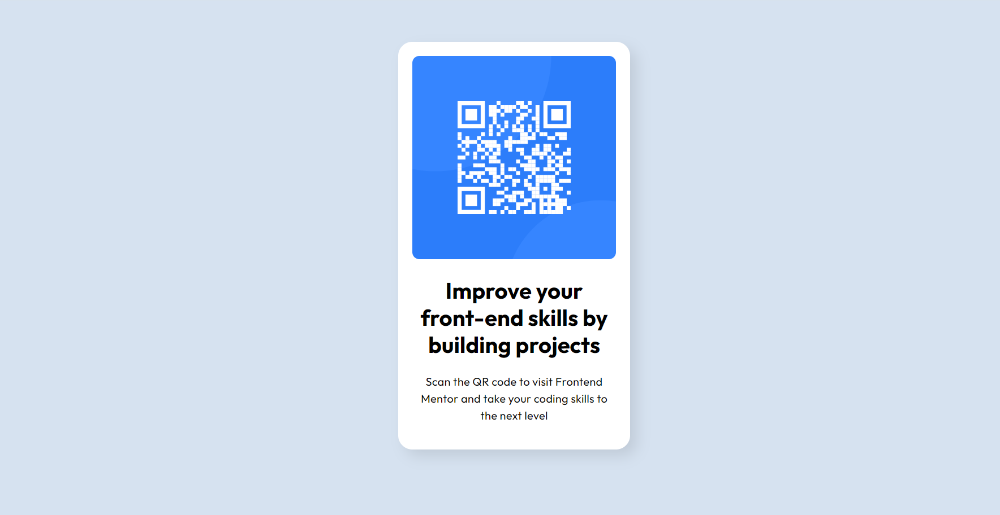

# Frontend Mentor - QR code component solution

This is a solution to the [QR code component challenge on Frontend Mentor](https://www.frontendmentor.io/challenges/qr-code-component-iux_sIO_H). Frontend Mentor challenges help you improve your coding skills by building realistic projects.

## Table of contents

- [Screenshot](#screenshot)
- [Links](#links)
- [Built with](#built-with)
- [What I learned](#what-i-learned)
- [Continued development](#continued-development)
- [Useful resources](#useful-resources)
- [Author](#author)
- [Acknowledgments](#acknowledgments)

### Screenshot

### Links

- Solution URL: [https://github.com/monicaivanov/QR-code-component.git]
- Live Site URL: [https://monicaivanov.github.io/QR-code-component/]

### Built with

- Semantic HTML5 markup
- CSS custom properties
- Flexbox

### What I learned

I learned how to use git with VS code, flexbox, and responsive design. Also how to add Google fonts.

### Continued development

I have a lot to learn and practice. This project has been my first tiny step into frontend dev.

### Useful resources

- [CSS Trics](https://css-tricks.com/snippets/css/a-guide-to-flexbox/) - This helped me understand flexbox and its a very useful resourse to comeback to anytime you need.

- [Web design tutorials](https://bringyourownlaptop.com) - This is an amazing source for design tutorials, beginer level but exactly what you need to understand building small projects in a practical way.

## Author

- Frontend Mentor - [@monicaivanov](https://www.frontendmentor.io/profile/monicaivanov)

## Acknowledgments

I would like to acknowledge myself for doing the work, believing in myself and taking the time to complete this challenge (especially write this REadMe file :-).
